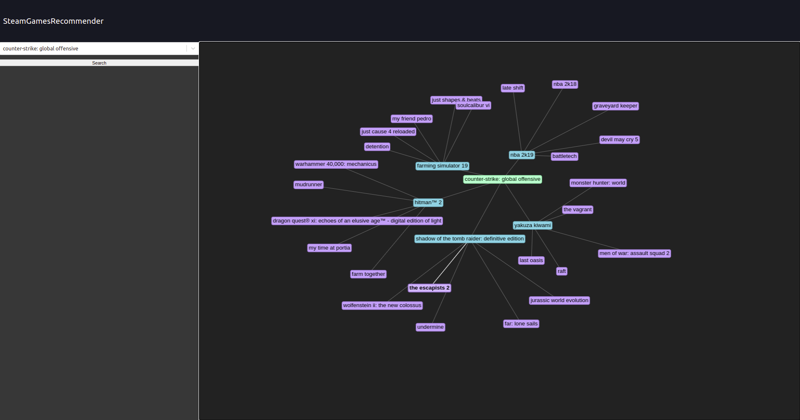
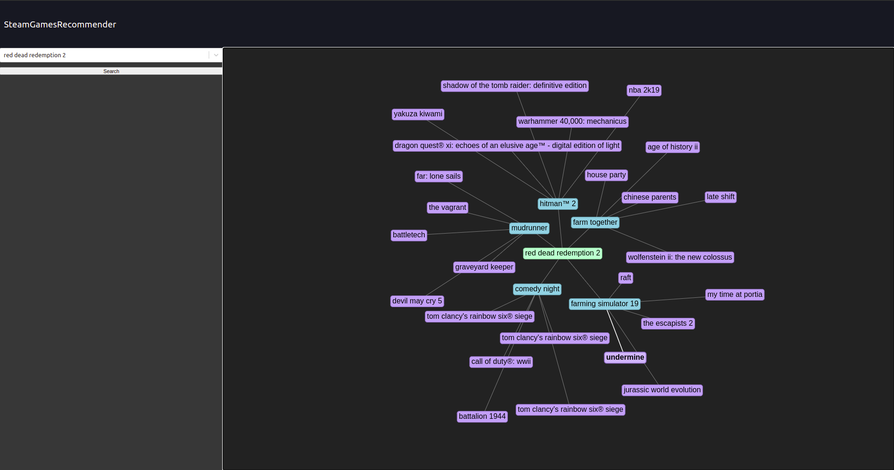
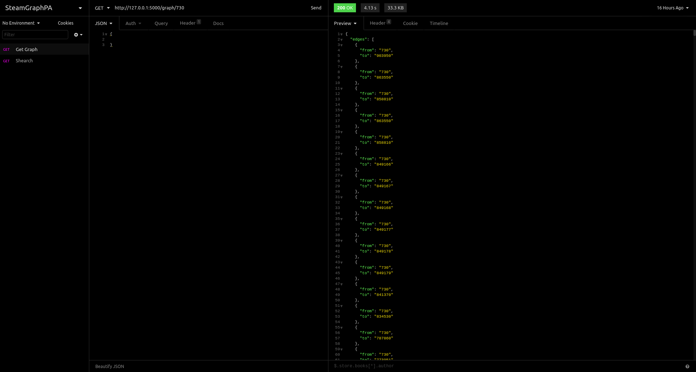
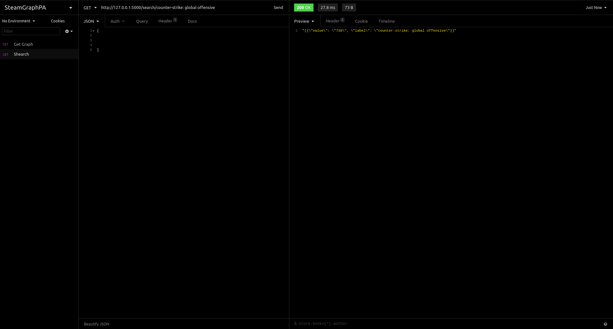

# SteamGamesRecommender

**Número da Lista**: 15<br>
**Conteúdo da Disciplina**: Grafos 1<br>

## Alunos
|Matrícula | Aluno |
| -- | -- |
| 18/0028685  |  Victor Samuel dos Santos Lucas |
| 18/0029177  |  Wagner Martins da Cunha |

## Sobre 
Este projeto tem como objetivo ser uma aplicaçação de recomendação simples baseada nas relações entre jogos da plataforma [Steam](https://store.steampowered.com/?l=portuguese), que por meio do uso de Grafos e do algorítmo BFS (Busca em Largura), realiza análises de semelhanças baseando-se em critérios de Categorias, Gêneros e Desenvolvedores. 


## Screenshots

### A aplicação
    
   

### Funcionamento no BackEnd
   
   

## Instalação 
#### Linguagem: 
* BackEnd: [Python](https://www.python.org/)
* FrontEnd: [JavaScript](https://www.javascript.com/)

#### Framework:
* BackEnd: [Flask](https://flask.palletsprojects.com/en/1.1.x/)
* FrontEnd: [React](https://pt-br.reactjs.org/)

#### Outras Tecnologias:
* [Insomnia](https://insomnia.rest/download/) (Plataforma para testes de Requisições).
* [Visual Studio Code](https://code.visualstudio.com/) (Editor de Texto).
* [Git](https://git-scm.com/) (Sistema de controle de Versão).
* [Vis Network](https://visjs.github.io/vis-network/examples/) (Biblioteca responsável pelos desenhos dos Grafos)
* [Steam API](https://api.steampowered.com/ISteamApps/GetAppList/v2/) (Api que contém todos os jogos da plataforma com suas respectivas informações)
## :warning: Como rodar o projeto?
Ter instalado as seguintes dependências
 
```
Python: Versão 3+
Node: Versão 12+
Npm: Versão 6+
```
Clonar este repositório

```
git clone https://github.com/projeto-de-algoritmos/Grafos1_SteamGamesRecommender.git
```
Acessar a pasta raiz do repositório 

```
cd Grafos1_SteamGamesRecommender
```
### Configurando o BackEnd
Acessar a pasta raiz do BackEnd (a partir da raiz do repositório)

```
cd backend
```
Para executar o backend, utilize o ambiente virtual venv:

```
python3 -m venv venv
```
Para executar o ambiente(em um linux), digite na raís desta pasta.

```
source ./venv/bin/activate
```
e por fim dê o comando

```
activate
```
Com o ambiente virtual ativado, instale as bibliotecas:

```
pip3 install -r requirements.txt
```
Por fim defina a variável de ambiente do flask e execute o mesmo:

```
export FLASK_APP=src/app.py
flask run
```
### Configurando o FrontEnd
Acessar a pasta raiz do FrontEnd (a partir da raiz do repositório)

```
cd frontend
```
Realize a instalação das dependências

```
npm install
```
Execute a aplicação no modo de desenvolvimento

```
npm start
```
#### :warning: Observações
O backend e o frontend abrem nas portas http://localhost:5000 e http://localhost:3000, respectivamente, logo se faz necessário que ambas estejam livres para uso.

## Uso 
Após a aplicação dos comandos citados nos tópicos anteriores, o projeto irá abrir no seu navegador padrão. 

* Para realizar o uso do projeto é muito simples, basta inserir o nome do jogo que em questão no campo de busca e apertar "Search", após isso, o grafo com as relações entre os jogos irá aparecer no campo à direita do seu navegador. 

## Vídeo de apresentação

O [vídeo da apresentação](https://github.com/projeto-de-algoritmos/Grafos1_SteamGamesRecommender/blob/master/apresentacao_steamgamesrecommender.mp4) está disponível no repositório. Entretanto, caso haja problemas na reprodução, o mesmo pode ser visualizado no [youtube](https://youtu.be/b7bXTcVlwpE).

## Desenvolvedores 
* Victor Samuel dos Santos Lucas - victor.samuelsantoss@gmail.com | Telegram: @victordsantoss | 
* Wagner Martins da Cunha - wagnermc506@gmail.com | Telegram: @wagnermc506 |
